# Tackle-thirst

This project is designed to help tackle thirst in Kenya by donating and contributing to different places

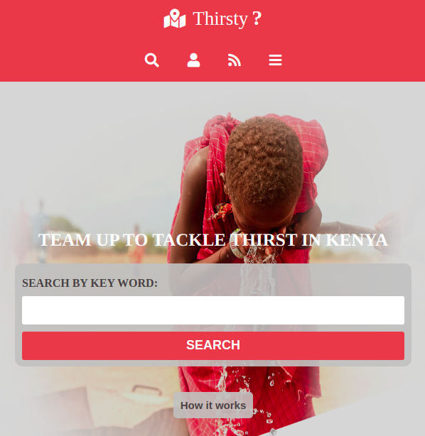
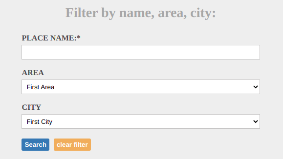
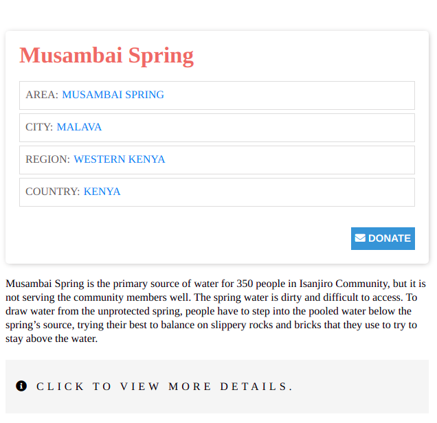
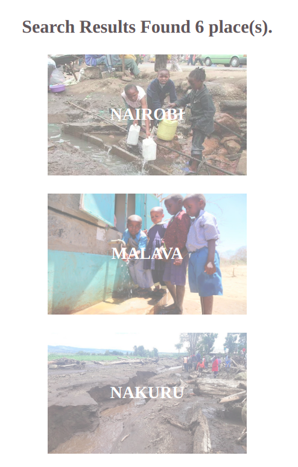
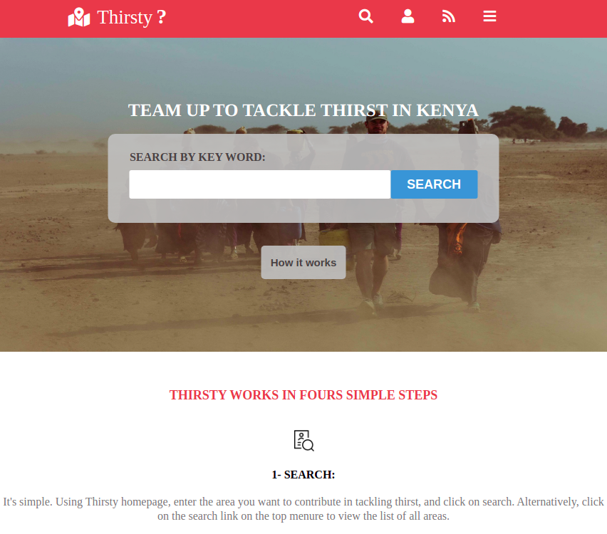
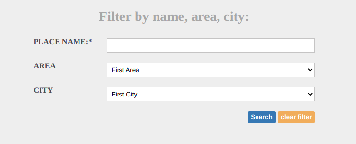
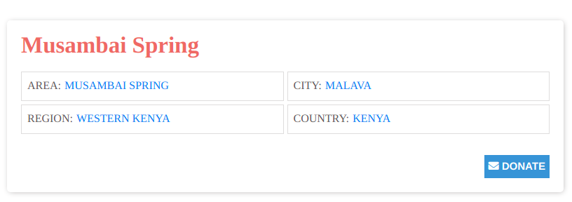
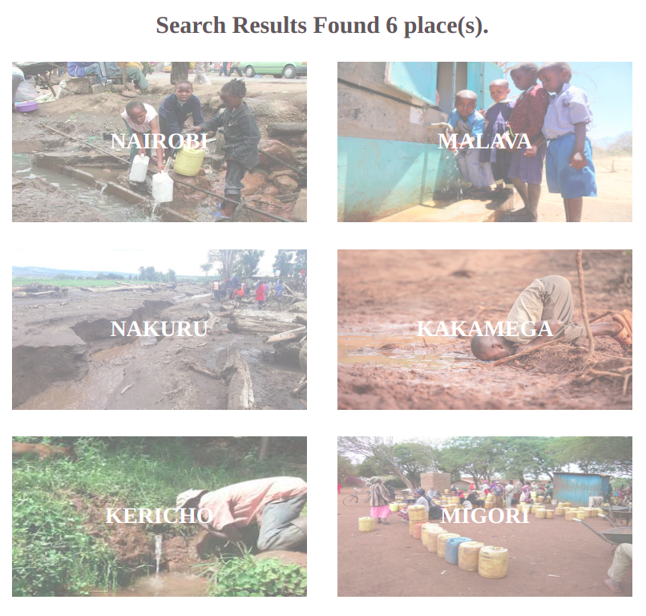
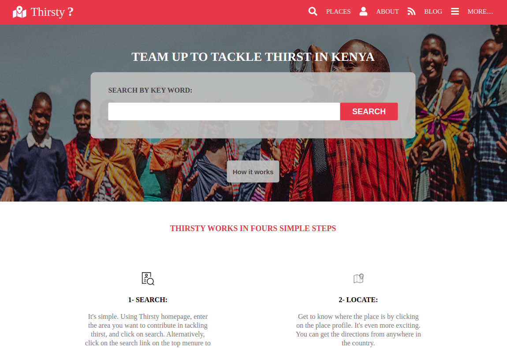
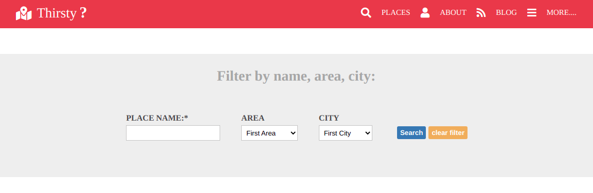
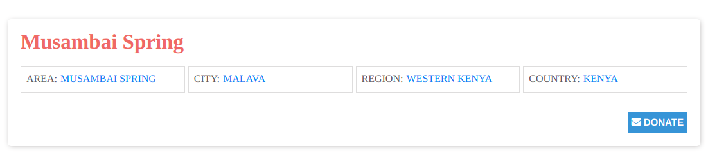
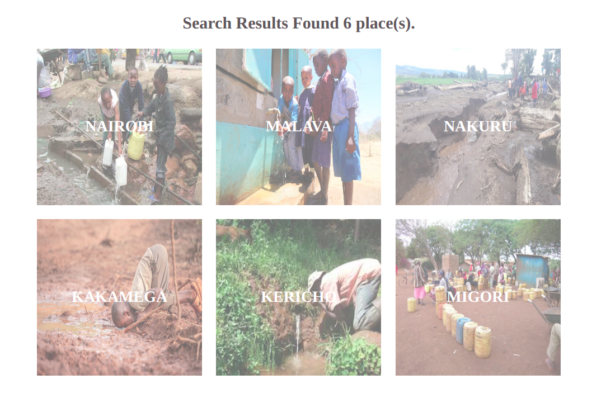
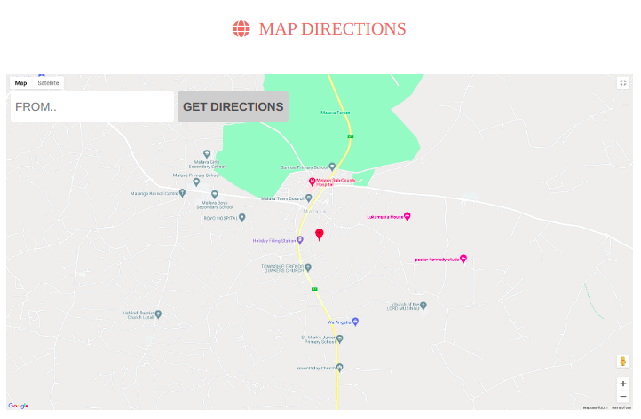
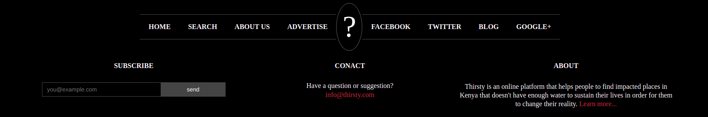

## Built With

- HTML
- CSS

## Live Demo

[Live Demo Link](https://mairizk.github.io/Tackle-thirst/)

## Additional information

This project contains 3 different screens that resize responsively to different screen sizes;
1- The home page that has the basic information about the project and also has the search engine
2- The search page that shows different places when you search
3- The place or area page that has the information about the place found.
Only one place area is designed and linked to all the places.
This is a static project built to practice HTML & CSS best practices.
The project's original design was created by Mathew Njuguna & Sam Achola.

## Authors

👤 **Mai Rizk**
- GitHub: [@MaiRizk](https://github.com/MaiRizk)
- Twitter: [@MaiRizk](https://twitter.com/MaiRizk16)
- LinkedIn: [LinkedIn](https://www.linkedin.com/in/mai-rizk-252722188/)

## 🤝 Contributing

Contributions, issues, and feature requests are welcome!

Feel free to check the [issues page](../../issues/).

## Show your support

Give a ⭐️ if you like this project!

## Acknowledgments

- Hat tip to anyone whose code was used
- Inspiration
- etc

## 📝 License

